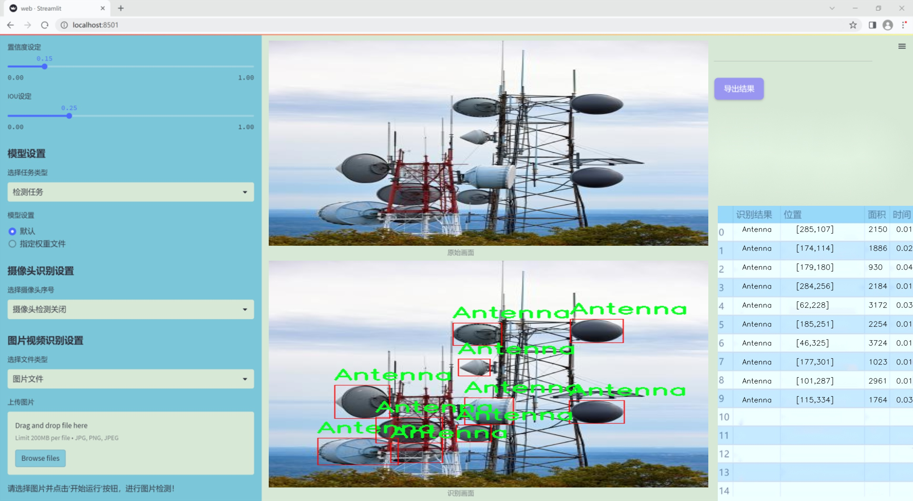
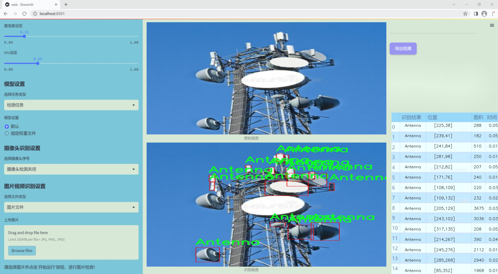
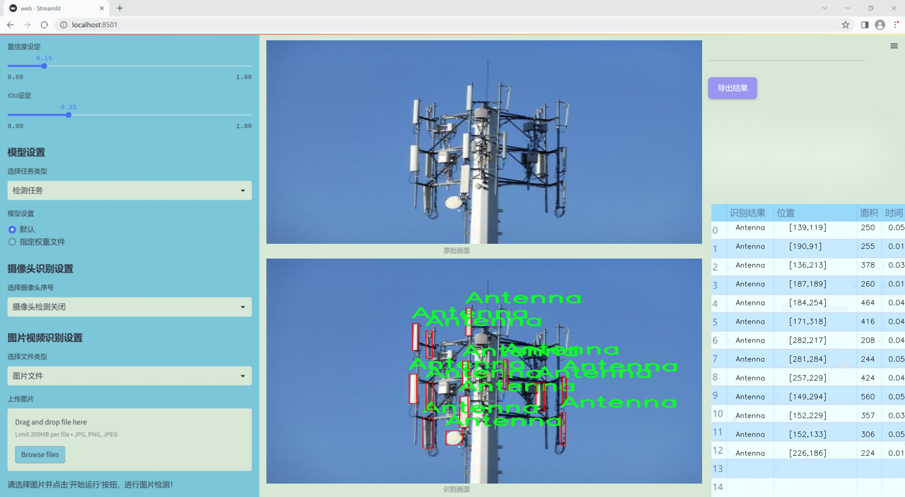
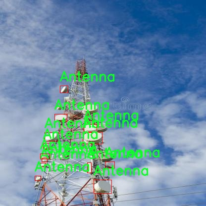
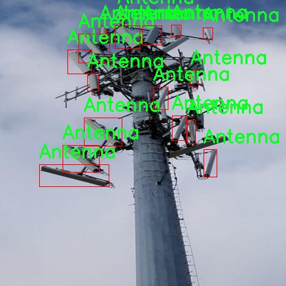
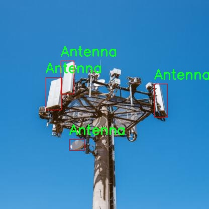
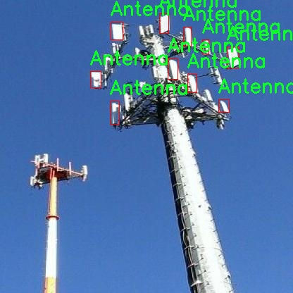
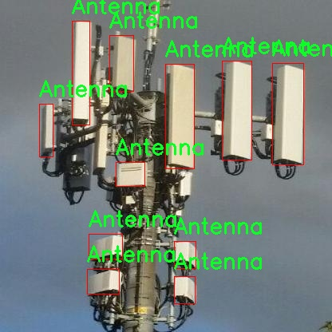

# 改进yolo11-aux等200+全套创新点大全：天线雷达检测系统源码＆数据集全套

### 1.图片效果展示







##### 项目来源 **[人工智能促进会 2024.10.22](https://kdocs.cn/l/cszuIiCKVNis)**

##### 注意：由于项目一直在更新迭代，上面“1.图片效果展示”和“2.视频效果展示”展示的系统图片或者视频可能为老版本，新版本在老版本的基础上升级如下：（实际效果以升级的新版本为准）

  （1）适配了YOLOV11的“目标检测”模型和“实例分割”模型，通过加载相应的权重（.pt）文件即可自适应加载模型。

  （2）支持“图片识别”、“视频识别”、“摄像头实时识别”三种识别模式。

  （3）支持“图片识别”、“视频识别”、“摄像头实时识别”三种识别结果保存导出，解决手动导出（容易卡顿出现爆内存）存在的问题，识别完自动保存结果并导出到tempDir中。

  （4）支持Web前端系统中的标题、背景图等自定义修改。

  另外本项目提供训练的数据集和训练教程,暂不提供权重文件（best.pt）,需要您按照教程进行训练后实现图片演示和Web前端界面演示的效果。

### 2.视频效果展示

[2.1 视频效果展示](https://www.bilibili.com/video/BV1peyRY5ENu/)

### 3.背景

研究背景与意义

随着无线通信技术的迅猛发展，天线作为信号传输和接收的关键组件，其检测与识别在现代通信系统中显得尤为重要。传统的天线检测方法多依赖于人工视觉或简单的图像处理技术，这不仅效率低下，而且容易受到环境因素的影响，导致检测结果的不准确性。近年来，深度学习技术的飞速进步为物体检测领域带来了新的机遇，尤其是YOLO（You Only Look Once）系列模型在实时目标检测方面表现出色，逐渐成为研究者和工程师的首选工具。

本研究旨在基于改进的YOLOv11模型，构建一个高效的天线雷达检测系统。通过对199幅包含天线的图像进行训练和测试，系统能够自动识别和定位图像中的天线目标。该数据集的构建不仅为模型的训练提供了丰富的样本，也为后续的算法优化和性能评估奠定了基础。值得注意的是，天线检测的准确性直接影响到无线通信系统的性能，因此，提升检测系统的精度和速度具有重要的实际意义。

此外，随着物联网和智能城市的发展，天线的数量和种类日益增加，传统的检测方法难以满足现代需求。基于改进YOLOv11的天线雷达检测系统，不仅能够提高检测效率，还能为未来的自动化监测和维护提供技术支持。通过对天线的实时监测，能够及时发现潜在问题，减少人工干预，提高系统的可靠性和安全性。因此，本研究不仅具有重要的学术价值，也在实际应用中展现出广阔的前景。

### 4.数据集信息展示

##### 4.1 本项目数据集详细数据（类别数＆类别名）

nc: 1
names: ['Antenna']


该项目为【目标检测】数据集，请在【训练教程和Web端加载模型教程（第三步）】这一步的时候按照【目标检测】部分的教程来训练

##### 4.2 本项目数据集信息介绍

本项目数据集信息介绍

本项目所使用的数据集名为“AntennaDetection”，旨在为改进YOLOv11的天线雷达检测系统提供高质量的训练数据。该数据集专注于单一类别的目标检测，类别数量为1，具体类别为“天线”。在现代雷达系统和无线通信技术中，天线的检测与识别是至关重要的，尤其是在复杂的环境中。因此，AntennaDetection数据集的构建旨在为深度学习模型提供丰富的样本，以提高其在天线检测任务中的准确性和鲁棒性。

数据集中的图像来源广泛，涵盖了不同的拍摄角度、光照条件和背景环境，确保模型能够学习到天线在各种情况下的特征。这些图像经过精心标注，确保每个天线目标都被准确框定，以便于YOLOv11模型在训练过程中能够有效地学习到目标的空间特征和外观特征。此外，数据集还包括了不同类型的天线样本，涵盖了从传统的金属天线到现代的隐形天线等多种形式，以增强模型的泛化能力。

在数据集的构建过程中，特别注重数据的多样性和代表性，以确保训练出的模型能够在实际应用中表现出色。通过对“AntennaDetection”数据集的充分利用，研究团队期望能够显著提升YOLOv11在天线检测任务中的性能，进而推动相关领域的技术进步与应用发展。此数据集不仅为模型训练提供了坚实的基础，也为后续的研究和开发提供了宝贵的资源，具有重要的学术和实际应用价值。











### 5.全套项目环境部署视频教程（零基础手把手教学）

[5.1 所需软件PyCharm和Anaconda安装教程（第一步）](https://www.bilibili.com/video/BV1BoC1YCEKi/?spm_id_from=333.999.0.0&vd_source=bc9aec86d164b67a7004b996143742dc)


[5.2 安装Python虚拟环境创建和依赖库安装视频教程（第二步）](https://www.bilibili.com/video/BV1ZoC1YCEBw?spm_id_from=333.788.videopod.sections&vd_source=bc9aec86d164b67a7004b996143742dc)

### 6.改进YOLOv11训练教程和Web_UI前端加载模型教程（零基础手把手教学）

[6.1 改进YOLOv11训练教程和Web_UI前端加载模型教程（第三步）](https://www.bilibili.com/video/BV1BoC1YCEhR?spm_id_from=333.788.videopod.sections&vd_source=bc9aec86d164b67a7004b996143742dc)


按照上面的训练视频教程链接加载项目提供的数据集，运行train.py即可开始训练



     Epoch   gpu_mem       box       obj       cls    labels  img_size
     1/200     20.8G   0.01576   0.01955  0.007536        22      1280: 100%|██████████| 849/849 [14:42<00:00,  1.04s/it]
               Class     Images     Labels          P          R     mAP@.5 mAP@.5:.95: 100%|██████████| 213/213 [01:14<00:00,  2.87it/s]
                 all       3395      17314      0.994      0.957      0.0957      0.0843

     Epoch   gpu_mem       box       obj       cls    labels  img_size
     2/200     20.8G   0.01578   0.01923  0.007006        22      1280: 100%|██████████| 849/849 [14:44<00:00,  1.04s/it]
               Class     Images     Labels          P          R     mAP@.5 mAP@.5:.95: 100%|██████████| 213/213 [01:12<00:00,  2.95it/s]
                 all       3395      17314      0.996      0.956      0.0957      0.0845

     Epoch   gpu_mem       box       obj       cls    labels  img_size
     3/200     20.8G   0.01561    0.0191  0.006895        27      1280: 100%|██████████| 849/849 [10:56<00:00,  1.29it/s]
               Class     Images     Labels          P          R     mAP@.5 mAP@.5:.95: 100%|███████   | 187/213 [00:52<00:00,  4.04it/s]
                 all       3395      17314      0.996      0.957      0.0957      0.0845


###### [项目数据集下载链接](https://kdocs.cn/l/cszuIiCKVNis)

### 7.原始YOLOv11算法讲解

##### YOLO11简介

> YOLO11源码地址：https://github.com/ultralytics/ultralytics

Ultralytics
YOLO11是一款尖端的、最先进的模型，它在之前YOLO版本成功的基础上进行了构建，并引入了新功能和改进，以进一步提升性能和灵活性。YOLO11设计快速、准确且易于使用，使其成为各种物体检测和跟踪、实例分割、图像分类以及姿态估计任务的绝佳选择。  


**YOLO11创新点如下:**

YOLO 11主要改进包括：  
`增强的特征提取`：YOLO 11采用了改进的骨干和颈部架构，增强了特征提取功能，以实现更精确的目标检测。  
`优化的效率和速度`：优化的架构设计和优化的训练管道提供更快的处理速度，同时保持准确性和性能之间的平衡。  
`更高的精度，更少的参数`：YOLO11m在COCO数据集上实现了更高的平均精度（mAP），参数比YOLOv8m少22%，使其在不影响精度的情况下提高了计算效率。  
`跨环境的适应性`：YOLO 11可以部署在各种环境中，包括边缘设备、云平台和支持NVIDIA GPU的系统。  
`广泛的支持任务`：YOLO 11支持各种计算机视觉任务，如对象检测、实例分割、图像分类、姿态估计和面向对象检测（OBB）。

**YOLO11不同模型尺寸信息：**

YOLO11 提供5种不同的型号规模模型，以满足不同的应用需求：

Model| size (pixels)| mAPval 50-95| Speed CPU ONNX (ms)| Speed T4 TensorRT10
(ms)| params (M)| FLOPs (B)  
---|---|---|---|---|---|---  
YOLO11n| 640| 39.5| 56.1 ± 0.8| 1.5 ± 0.0| 2.6| 6.5  
YOLO11s| 640| 47.0| 90.0 ± 1.2| 2.5 ± 0.0| 9.4| 21.5  
YOLO11m| 640| 51.5| 183.2 ± 2.0| 4.7 ± 0.1| 20.1| 68.0  
YOLO11l| 640| 53.4| 238.6 ± 1.4| 6.2 ± 0.1| 25.3| 86.9  
YOLO11x| 640| 54.7| 462.8 ± 6.7| 11.3 ± 0.2| 56.9| 194.9  
  
**模型常用训练超参数参数说明：**  
`YOLOv11
模型的训练设置包括训练过程中使用的各种超参数和配置`。这些设置会影响模型的性能、速度和准确性。关键的训练设置包括批量大小、学习率、动量和权重衰减。此外，优化器、损失函数和训练数据集组成的选择也会影响训练过程。对这些设置进行仔细的调整和实验对于优化性能至关重要。  
**以下是一些常用的模型训练参数和说明：**

参数名| 默认值| 说明  
---|---|---  
`model`| `None`| 指定用于训练的模型文件。接受指向 `.pt` 预训练模型或 `.yaml`
配置文件。对于定义模型结构或初始化权重至关重要。  
`data`| `None`| 数据集配置文件的路径（例如
`coco8.yaml`).该文件包含特定于数据集的参数，包括训练数据和验证数据的路径、类名和类数。  
`epochs`| `100`| 训练总轮数。每个epoch代表对整个数据集进行一次完整的训练。调整该值会影响训练时间和模型性能。  
`patience`| `100`| 在验证指标没有改善的情况下，提前停止训练所需的epoch数。当性能趋于平稳时停止训练，有助于防止过度拟合。  
`batch`| `16`| 批量大小，有三种模式:设置为整数(例如，’ Batch =16 ‘)， 60% GPU内存利用率的自动模式(’ Batch
=-1 ‘)，或指定利用率分数的自动模式(’ Batch =0.70 ')。  
`imgsz`| `640`| 用于训练的目标图像尺寸。所有图像在输入模型前都会被调整到这一尺寸。影响模型精度和计算复杂度。  
`device`| `None`| 指定用于训练的计算设备：单个 GPU (`device=0`）、多个 GPU (`device=0,1`)、CPU
(`device=cpu`)，或苹果芯片的 MPS (`device=mps`).  
`workers`| `8`| 加载数据的工作线程数（每 `RANK` 多 GPU 训练）。影响数据预处理和输入模型的速度，尤其适用于多 GPU 设置。  
`name`| `None`| 训练运行的名称。用于在项目文件夹内创建一个子目录，用于存储训练日志和输出结果。  
`pretrained`| `True`| 决定是否从预处理模型开始训练。可以是布尔值，也可以是加载权重的特定模型的字符串路径。提高训练效率和模型性能。  
`optimizer`| `'auto'`| 为训练模型选择优化器。选项包括 `SGD`, `Adam`, `AdamW`, `NAdam`,
`RAdam`, `RMSProp` 等，或 `auto` 用于根据模型配置进行自动选择。影响收敛速度和稳定性  
`lr0`| `0.01`| 初始学习率（即 `SGD=1E-2`, `Adam=1E-3`) .调整这个值对优化过程至关重要，会影响模型权重的更新速度。  
`lrf`| `0.01`| 最终学习率占初始学习率的百分比 = (`lr0 * lrf`)，与调度程序结合使用，随着时间的推移调整学习率。  


**各损失函数作用说明：**  
`定位损失box_loss`：预测框与标定框之间的误差（GIoU），越小定位得越准；  
`分类损失cls_loss`：计算锚框与对应的标定分类是否正确，越小分类得越准；  
`动态特征损失（dfl_loss）`：DFLLoss是一种用于回归预测框与目标框之间距离的损失函数。在计算损失时，目标框需要缩放到特征图尺度，即除以相应的stride，并与预测的边界框计算Ciou
Loss，同时与预测的anchors中心点到各边的距离计算回归DFLLoss。  


### 8.200+种全套改进YOLOV11创新点原理讲解

#### 8.1 200+种全套改进YOLOV11创新点原理讲解大全

由于篇幅限制，每个创新点的具体原理讲解就不全部展开，具体见下列网址中的改进模块对应项目的技术原理博客网址【Blog】（创新点均为模块化搭建，原理适配YOLOv5~YOLOv11等各种版本）

[改进模块技术原理博客【Blog】网址链接](https://gitee.com/qunmasj/good)


#### 8.2 精选部分改进YOLOV11创新点原理讲解

###### 这里节选部分改进创新点展开原理讲解(完整的改进原理见上图和[改进模块技术原理博客链接](https://gitee.com/qunmasj/good)【如果此小节的图加载失败可以通过CSDN或者Github搜索该博客的标题访问原始博客，原始博客图片显示正常】


### D-LKA Attention简介
自2010年代中期以来，卷积神经网络（CNNs）已成为许多计算机视觉应用的首选技术。它们能够从原始数据中自动提取复杂的特征表示，无需手动进行特征工程，这引起了医学图像分析社区的极大兴趣。许多成功的CNN架构，如U-Net、全卷积网络、DeepLab或SegCaps（分割胶囊），已经被开发出来。这些架构在语义分割任务中取得了巨大成功，先前的最新方法已经被超越。

在计算机视觉研究中，不同尺度下的目标识别是一个关键问题。在CNN中，可检测目标的大小与相应网络层的感受野尺寸密切相关。如果一个目标扩展到超出这个感受野的边界，这可能会导致欠分割结果。相反，与目标实际大小相比使用过大的感受野可能会限制识别，因为背景信息可能会对预测产生不必要的影响。

解决这个问题的一个有希望的方法涉及在并行使用具有不同尺寸的多个Kernel，类似于Inception块的机制。然而，由于参数和计算要求的指数增长，将Kernel大小增加以容纳更大的目标在实践中受到限制。因此，出现了各种策略，包括金字塔池化技术和不同尺度的扩张卷积，以捕获多尺度的上下文信息。

另一个直观的概念涉及将多尺度图像金字塔或它们的相关特征表示直接纳入网络架构。然而，这种方法存在挑战，特别是在管理训练和推理时间方面的可行性方面存在挑战。在这个背景下，使用编码器-解码器网络，如U-Net，已被证明是有利的。这样的网络在较浅的层中编码外观和位置，而在更深的层中，通过神经元的更广泛的感受野捕获更高的语义信息和上下文信息。

一些方法将来自不同层的特征组合在一起，或者预测来自不同尺寸的层的特征以使用多尺度的信息。此外，出现了从不同尺度的层中预测特征的方法，有效地实现了跨多个尺度的见解整合。然而，大多数编码器-解码器结构面临一个挑战：它们经常无法在不同尺度之间保持一致的特征，并主要使用最后一个解码器层生成分割结果。

语义分割是一项任务，涉及根据预定义的标签集为图像中的每个像素预测语义类别。这项任务要求提取高级特征同时保留初始的空间分辨率。CNNs非常适合捕获局部细节和低级信息，尽管以忽略全局上下文为代价。视觉Transformer（ViT）架构已经成为解决处理全局信息的视觉任务的关键，包括语义分割，取得了显著的成功。

ViT的基础是注意力机制，它有助于在整个输入序列上聚合信息。这种能力使网络能够合并远程的上下文提示，超越了CNN的有限感受野尺寸。然而，这种策略通常会限制ViT有效建模局部信息的能力。这种局限可能会妨碍它们检测局部纹理的能力，这对于各种诊断和预测任务至关重要。这种缺乏局部表示可以归因于ViT模型处理图像的特定方式。

ViT模型将图像分成一系列Patch，并使用自注意力机制来模拟它们之间的依赖关系。这种方法可能不如CNN模型中的卷积操作对感受野内提取局部特征有效。ViT和CNN模型之间的这种图像处理方法的差异可能解释了CNN模型在局部特征提取方面表现出色的原因。

近年来，已经开发出创新性方法来解决Transformer模型内部局部纹理不足的问题。其中一种方法是通过互补方法将CNN和ViT特征结合起来，以结合它们的优势并减轻局部表示的不足。TransUNet是这种方法的早期示例，它在CNN的瓶颈中集成了Transformer层，以模拟局部和全局依赖关系。HiFormer提出了一种解决方案，将Swin Transformer模块和基于CNN的编码器结合起来，生成两个多尺度特征表示，通过Double-Level Fusion模块集成。UNETR使用基于Transformer的编码器和CNN解码器进行3D医学图像分割。CoTr和TransBTS通过Transformer在低分辨率阶段增强分割性能，将CNN编码器和解码器连接在一起。

增强局部特征表示的另一种策略是重新设计纯Transformer模型内部的自注意力机制。在这方面，Swin-Unet在U形结构中集成了一个具有线性计算复杂性的Swin Transformer块作为多尺度 Backbone 。MISSFormer采用高效Transformer来解决视觉Transformer中的参数问题，通过在输入块上进行不可逆的降采样操作。D-Former引入了一个纯Transformer的管道，具有双重注意模块，以分段的方式捕获细粒度的局部注意和与多元单元的交互。然而，仍然存在一些特定的限制，包括计算效率低下，如TransUNet模型所示，对CNN Backbone 的严重依赖，如HiFormer所观察到的，以及对多尺度信息的忽略。

此外，目前的分割架构通常采用逐层处理3D输入 volumetric 的方法，无意中忽视了相邻切片之间的潜在相关性。这一疏忽限制了对 volumetric 信息的全面利用，因此损害了定位精度和上下文集成。此外，必须认识到，医学领域的病变通常在形状上发生变形。因此，用于医学图像分析的任何学习算法都必须具备捕捉和理解这些变形的能力。与此同时，该算法应保持计算效率，以便处理3D volumetric数据。

为了解决上述提到的挑战，作者提出了一个解决方案，即可变形大卷积核注意力模块（Deformable LKA module），它是作者网络设计的基本构建模块。这个模块明确设计成在有效处理上下文信息的同时保留局部描述符。作者的架构在这两个方面的平衡增强了实现精确语义分割的能力。

值得注意的是，参考该博客引入了一种基于数据的感受野的动态适应，不同于传统卷积操作中的固定滤波器Mask。这种自适应方法使作者能够克服与静态方法相关的固有限制。这种创新方法还扩展到了D-LKA Net架构的2D和3D版本的开发。

在3D模型的情况下，D-LKA机制被量身定制以适应3D环境，从而实现在不同 volumetric 切片之间无缝信息交互。最后，作者的贡献通过其计算效率得到进一步强调。作者通过仅依靠D-LKA概念的设计来实现这一点，在各种分割基准上取得了显著的性能，确立了作者的方法作为一种新的SOTA方法。

在本节中，作者首先概述方法论。首先，作者回顾了由Guo等人引入的大卷积核注意力（Large Kernel Attention，LKA）的概念。然后，作者介绍了作者对可变形LKA模块的创新探索。在此基础上，作者介绍了用于分割任务的2D和3D网络架构。

大卷积核提供了与自注意力机制类似的感受野。可以通过使用深度卷积、深度可扩展卷积和卷积来构建大卷积核，从而减少了参数和计算量。构建输入维度为和通道数的卷积核的深度卷积和深度可扩展卷积的卷积核大小的方程如下：


具有卷积核大小和膨胀率。参数数量和浮点运算（FLOPs）的计算如下：


FLOPs的数量与输入图像的大小成线性增长。参数的数量随通道数和卷积核大小的增加而呈二次增长。然而，由于它们通常都很小，因此它们不是限制因素。

为了最小化对于固定卷积核大小K的参数数量，可以将方程3对于膨胀率的导数设定为零：


例如，当卷积核大小为时，结果是。将这些公式扩展到3D情况是直接的。对于大小为和通道数C的输入，3D情况下参数数量和FLOPs 的方程如下：


具有卷积核大小和膨胀。


利用大卷积核进行医学图像分割的概念通过引入可变形卷积得以扩展。可变形卷积可以通过整数偏移自由调整采样网格以进行自由变形。额外的卷积层从特征图中学习出变形，从而创建一个偏移场。基于特征本身学习变形会导致自适应卷积核。这种灵活的卷积核形状可以提高病变或器官变形的表示，从而增强了目标边界的定义。

负责计算偏移的卷积层遵循其相应卷积层的卷积核大小和膨胀。双线性插值用于计算不在图像网格上的偏移的像素值。如图2所示，D-LKA模块可以表示为：


其中输入特征由表示，。表示为注意力图，其中每个值表示相应特征的相对重要性。运算符  表示逐元素乘法运算。值得注意的是，LKA不同于传统的注意力方法，它不需要额外的规范化函数，如或。这些规范化函数往往忽视高频信息，从而降低了基于自注意力的方法的性能。

在该方法的2D版本中，卷积层被可变形卷积所替代，因为可变形卷积能够改善对具有不规则形状和大小的目标的捕捉能力。这些目标在医学图像数据中常常出现，因此这种增强尤为重要。

然而，将可变形LKA的概念扩展到3D领域会带来一定的挑战。主要的约束来自于需要用于生成偏移的额外卷积层。与2D情况不同，由于输入和输出通道的性质，这一层无法以深度可分的方式执行。在3D环境中，输入通道对应于特征，而输出通道扩展到，其中是卷积核的大小。大卷积核的复杂性导致沿第3D的通道数扩展，导致参数和FLOPs大幅增加。因此，针对3D情况采用了另一种替代方法。在现有的LKA框架中，深度卷积之后引入了一个单独的可变形卷积层。这种战略性的设计调整旨在减轻扩展到3D领域所带来的挑战。


2D网络的架构如图1所示。第一变种使用MaxViT作为编码器组件，用于高效特征提取，而第二变种则结合可变形LKA层进行更精细、卓越的分割。

在更正式的描述中，编码器生成4个分层输出表示。首先，卷积干扰将输入图像的维度减小到。随后，通过4个MaxViT块的4个阶段进行特征提取，每个阶段后跟随降采样层。随着过程进展到解码器，实施了4个阶段的D-LKA层，每个阶段包含2个D-LKA块。然后，应用Patch扩展层以实现分辨率上采样，同时减小通道维度。最后，线性层负责生成最终的输出。

2D D-LKA块的结构包括LayerNorm、可变形LKA和多层感知器（MLP）。积分残差连接确保了有效的特征传播，即使在更深层也是如此。这个安排可以用数学方式表示为：


其中输入特征，层归一化LN，可变形LKA注意力，深度卷积，线性层和GeLU激活函数。

3D网络架构如图1所示，采用编码器-解码器设计进行分层结构化。首先，一个Patch嵌入层将输入图像的维度从（）减小到（）。在编码器中，采用了3个D-LKA阶段的序列，每个阶段包含3个D-LKA块。在每个阶段之后，通过降采样步骤将空间分辨率减半，同时将通道维度加倍。中央瓶颈包括另一组2个D-LKA块。解码器结构与编码器相对称。

为了将特征分辨率加倍，同时减少通道数，使用转置卷积。每个解码器阶段都使用3个D-LKA块来促进远距离特征依赖性。最终的分割输出由一个卷积层产生，后面跟随一个卷积层以匹配特定类别的通道要求。

为了建立输入图像和分割输出之间的直接连接，使用卷积形成了一个跳跃连接。额外的跳跃连接根据简单的加法对来自其他阶段的特征进行融合。最终的分割图是通过和卷积层的组合产生的。

3D D-LKA块包括层归一化，后跟D-LKA注意力，应用了残差连接的部分。随后的部分采用了一个卷积层，后面跟随一个卷积层，两者都伴随着残差连接。这个整个过程可以总结如下：


带有输入特征 、层归一化 、可变形 LKA 、卷积层 和输出特征 的公式。是指一个前馈网络，包括2个卷积层和激活函数。

表7显示了普通卷积和构建卷积的参数数量比较。尽管标准卷积的参数数量在通道数较多时急剧增加，但分解卷积的参数总体较低，并且增长速度不那么快。

与分解卷积相比，可变形分解卷积增加了大量参数，但仍然明显小于标准卷积。可变形卷积的主要参数是由偏移网络创建的。在这里，作者假设可变形深度卷积的Kernel大小为（5,5），可变形深度空洞卷积的Kernel大小为（7,7）。这导致了21×21大小的大Kernel的最佳参数数量。更高效地生成偏移量的方法将大大减少参数数量。


值得注意的是，引入可变形LKA确实会增加模型的参数数量和每秒的浮点运算次数（FLOPS）。然而，重要的是强调，这增加的计算负载不会影响作者模型的整体推理速度。

相反，对于Batch-size > 1，作者甚至观察到推理时间的减少，如图7所示。例如，基于作者的广泛实验，作者观察到对于Batch-size为16，具有可变形卷积和没有可变形卷积的推理时间分别为8.01毫秒和17.38毫秒。作者认为这是由于在2D中对可变形卷积的高效实现所致。为了测量时间，使用了大小为（）的随机输入。在GPU热身周期50次迭代之后，网络被推断了1000次。测量是在NVIDIA RTX 3090 GPU上进行的。


为了充分利用性能与参数之间的权衡关系，作者在图8中可视化了在Synapse 2D数据集上报告的DSC和HD性能以及基于参数数量的内存消耗。D-LKA Net引入了相当多的参数，约为101M。这比性能第二好的方法ScaleFormer使用的111.6M参数要少。

与更轻量级的DAEFormer模型相比，作者实现了更好的性能，这证明了参数增加的合理性。大多数参数来自于MaxViT编码器；因此，将编码器替换为更高效的编码器可以减少模型参数。值得注意的是，在此可视化中，作者最初将HD和内存值都归一化到[0, 100]范围内。随后，作者将它们从100缩小，以增强更高值的表示。


### 9.系统功能展示

图9.1.系统支持检测结果表格显示

  图9.2.系统支持置信度和IOU阈值手动调节

  图9.3.系统支持自定义加载权重文件best.pt(需要你通过步骤5中训练获得)

  图9.4.系统支持摄像头实时识别

  图9.5.系统支持图片识别

  图9.6.系统支持视频识别

  图9.7.系统支持识别结果文件自动保存

  图9.8.系统支持Excel导出检测结果数据


### 10. YOLOv11核心改进源码讲解

#### 10.1 mamba_yolo.py

以下是代码中最核心的部分，并附上详细的中文注释：

```python
import torch
import torch.nn as nn
from einops import rearrange

class LayerNorm2d(nn.Module):
    """自定义的二维层归一化类"""
    def __init__(self, normalized_shape, eps=1e-6, elementwise_affine=True):
        super().__init__()
        self.norm = nn.LayerNorm(normalized_shape, eps, elementwise_affine)

    def forward(self, x):
        # 将输入的形状从 (B, C, H, W) 转换为 (B, H, W, C)
        x = rearrange(x, 'b c h w -> b h w c').contiguous()
        x = self.norm(x)  # 进行层归一化
        # 将形状转换回 (B, C, H, W)
        x = rearrange(x, 'b h w c -> b c h w').contiguous()
        return x

class CrossScan(torch.autograd.Function):
    """交叉扫描操作的自定义函数"""
    @staticmethod
    def forward(ctx, x: torch.Tensor):
        B, C, H, W = x.shape
        ctx.shape = (B, C, H, W)
        xs = x.new_empty((B, 4, C, H * W))  # 创建一个新的张量用于存储结果
        xs[:, 0] = x.flatten(2, 3)  # 将输入展平
        xs[:, 1] = x.transpose(dim0=2, dim1=3).flatten(2, 3)  # 转置并展平
        xs[:, 2:4] = torch.flip(xs[:, 0:2], dims=[-1])  # 反转前两个结果
        return xs

    @staticmethod
    def backward(ctx, ys: torch.Tensor):
        B, C, H, W = ctx.shape
        L = H * W
        # 反向传播时的计算
        ys = ys[:, 0:2] + ys[:, 2:4].flip(dims=[-1]).view(B, 2, -1, L)
        y = ys[:, 0] + ys[:, 1].view(B, -1, W, H).transpose(dim0=2, dim1=3).contiguous().view(B, -1, L)
        return y.view(B, -1, H, W)

def cross_selective_scan(
        x: torch.Tensor,
        x_proj_weight: torch.Tensor,
        dt_projs_weight: torch.Tensor,
        A_logs: torch.Tensor,
        Ds: torch.Tensor,
        out_norm: torch.nn.Module,
        nrows=-1,
        backnrows=-1,
        delta_softplus=True,
):
    """交叉选择性扫描操作"""
    B, D, H, W = x.shape
    L = H * W

    xs = CrossScan.apply(x)  # 进行交叉扫描

    # 进行投影操作
    x_dbl = torch.einsum("b k d l, k c d -> b k c l", xs, x_proj_weight)
    dts, Bs, Cs = torch.split(x_dbl, [R, N, N], dim=2)  # 分割结果
    dts = torch.einsum("b k r l, k d r -> b k d l", dts, dt_projs_weight)  # 进行另一个投影

    # HiPPO矩阵
    As = -torch.exp(A_logs.to(torch.float))  # 计算A矩阵
    delta_bias = dt_projs_bias.view(-1).to(torch.float)

    # 选择性扫描
    ys: torch.Tensor = selective_scan(
        xs, dts, As, Bs, Cs, Ds, delta_bias, delta_softplus
    ).view(B, K, -1, H, W)

    # 进行合并操作
    y: torch.Tensor = CrossMerge.apply(ys)

    # 进行输出归一化
    y = out_norm(y.transpose(dim0=1, dim1=2).contiguous()).view(B, H, W, -1)

    return y

class SS2D(nn.Module):
    """选择性扫描2D模块"""
    def __init__(self, d_model=96, d_state=16, ssm_ratio=2.0, act_layer=nn.SiLU, dropout=0.0):
        super().__init__()
        self.in_proj = nn.Conv2d(d_model, d_model * ssm_ratio, kernel_size=1)  # 输入投影
        self.out_proj = nn.Conv2d(d_model * ssm_ratio, d_model, kernel_size=1)  # 输出投影
        self.act = act_layer()  # 激活函数
        self.dropout = nn.Dropout(dropout)  # Dropout层

    def forward(self, x: torch.Tensor):
        x = self.in_proj(x)  # 输入投影
        x = self.act(x)  # 激活
        x = self.dropout(x)  # Dropout
        x = self.out_proj(x)  # 输出投影
        return x

class VSSBlock_YOLO(nn.Module):
    """YOLO的选择性扫描块"""
    def __init__(self, in_channels: int, hidden_dim: int, drop_path: float):
        super().__init__()
        self.proj_conv = nn.Conv2d(in_channels, hidden_dim, kernel_size=1)  # 投影卷积
        self.ss2d = SS2D(d_model=hidden_dim)  # 选择性扫描模块
        self.drop_path = nn.Dropout(drop_path)  # DropPath层

    def forward(self, input: torch.Tensor):
        input = self.proj_conv(input)  # 投影
        x = self.ss2d(input)  # 选择性扫描
        x = self.drop_path(x)  # DropPath
        return x
```

### 代码核心部分说明：
1. **LayerNorm2d**: 自定义的二维层归一化模块，主要用于对输入的特征图进行归一化处理。
2. **CrossScan**: 自定义的交叉扫描操作，用于对输入的特征图进行不同方向的展平和反转操作。
3. **cross_selective_scan**: 主要的选择性扫描函数，结合了交叉扫描和投影操作，最终输出经过归一化的结果。
4. **SS2D**: 选择性扫描的2D模块，负责输入的投影、激活和输出的投影。
5. **VSSBlock_YOLO**: YOLO模型中的选择性扫描块，整合了投影卷积和选择性扫描模块，提供了对输入特征的处理。

这些核心部分构成了模型的基础，负责特征的处理和变换。

这个文件 `mamba_yolo.py` 实现了一个基于深度学习的视觉模型，主要用于目标检测等计算机视觉任务。代码中使用了 PyTorch 框架，并结合了一些高级特性，如自定义的前向和反向传播函数、层归一化、卷积层等。以下是对文件中主要部分的详细说明。

首先，文件导入了必要的库，包括 PyTorch、数学库、函数式编程工具以及一些类型提示。接着，定义了一个 `LayerNorm2d` 类，该类实现了二维层归一化，适用于图像数据。它通过调整输入的维度顺序来应用 `nn.LayerNorm`，以确保在处理图像时的正确性。

接下来，定义了一个 `autopad` 函数，用于自动计算卷积操作所需的填充量，以确保输出的空间维度与输入相同。这个函数在卷积层的实现中非常有用。

随后，文件中实现了几个自定义的 PyTorch 自动求导函数，如 `CrossScan` 和 `CrossMerge`，这些函数用于在特征图上执行特定的操作，如交叉扫描和合并。这些操作通过自定义的前向和反向传播逻辑来实现，以优化计算过程。

在 `SelectiveScanCore` 类中，定义了一个选择性扫描的核心功能，允许在特征图上进行选择性操作，以提高模型的效率和性能。该类使用 CUDA 加速来处理数据，确保在 GPU 上运行时的高效性。

接下来，定义了一个 `cross_selective_scan` 函数，它封装了选择性扫描的过程，接收多个输入参数并返回处理后的特征图。这个函数的设计使得模型在处理复杂数据时更加灵活。

然后，定义了 `SS2D` 类，这是一个重要的模块，结合了多个深度学习技术，如卷积、线性变换和选择性扫描。该类的构造函数中定义了多个参数，包括模型的维度、状态维度、激活函数等。它还包含了一些初始化方法，用于设置特定的参数值。

`RGBlock` 和 `LSBlock` 类实现了特征图的处理模块，分别通过卷积和激活函数对输入进行变换，增强模型的表达能力。

`XSSBlock` 和 `VSSBlock_YOLO` 类是更复杂的模块，结合了之前定义的组件，形成了一个完整的处理单元。这些模块在输入特征图上执行多层次的变换，并通过残差连接增强信息流动。

`SimpleStem` 类实现了一个简单的卷积网络结构，用于将输入特征图的维度降低，同时提取重要特征。`VisionClueMerge` 类则负责将多个特征图合并，以便在后续的处理步骤中使用。

总体来说，这个文件实现了一个复杂的视觉模型，利用深度学习的多种技术，旨在提高目标检测等任务的性能。通过自定义的层和模块，模型能够有效地处理图像数据，并在特征提取和信息融合方面表现出色。

#### 10.2 convnextv2.py

以下是提取出的核心代码部分，并附上详细的中文注释：

```python
import torch
import torch.nn as nn
import torch.nn.functional as F

class LayerNorm(nn.Module):
    """ 自定义的LayerNorm层，支持两种数据格式：channels_last（默认）和channels_first。
    channels_last对应输入形状为(batch_size, height, width, channels)，
    而channels_first对应输入形状为(batch_size, channels, height, width)。
    """
    def __init__(self, normalized_shape, eps=1e-6, data_format="channels_last"):
        super().__init__()
        # 权重和偏置初始化
        self.weight = nn.Parameter(torch.ones(normalized_shape))
        self.bias = nn.Parameter(torch.zeros(normalized_shape))
        self.eps = eps
        self.data_format = data_format
        if self.data_format not in ["channels_last", "channels_first"]:
            raise NotImplementedError 
        self.normalized_shape = (normalized_shape, )
    
    def forward(self, x):
        # 根据数据格式选择不同的归一化方式
        if self.data_format == "channels_last":
            return F.layer_norm(x, self.normalized_shape, self.weight, self.bias, self.eps)
        elif self.data_format == "channels_first":
            u = x.mean(1, keepdim=True)  # 计算均值
            s = (x - u).pow(2).mean(1, keepdim=True)  # 计算方差
            x = (x - u) / torch.sqrt(s + self.eps)  # 标准化
            x = self.weight[:, None, None] * x + self.bias[:, None, None]  # 应用权重和偏置
            return x

class Block(nn.Module):
    """ ConvNeXtV2中的基本块，包含深度可分离卷积和其他层。
    
    Args:
        dim (int): 输入通道数。
    """
    def __init__(self, dim):
        super().__init__()
        self.dwconv = nn.Conv2d(dim, dim, kernel_size=7, padding=3, groups=dim)  # 深度可分离卷积
        self.norm = LayerNorm(dim, eps=1e-6)  # 层归一化
        self.pwconv1 = nn.Linear(dim, 4 * dim)  # 1x1卷积（用线性层实现）
        self.act = nn.GELU()  # 激活函数
        self.pwconv2 = nn.Linear(4 * dim, dim)  # 1x1卷积（用线性层实现）

    def forward(self, x):
        input = x  # 保存输入以便后续残差连接
        x = self.dwconv(x)  # 深度可分离卷积
        x = self.norm(x)  # 归一化
        x = self.pwconv1(x)  # 第一个1x1卷积
        x = self.act(x)  # 激活
        x = self.pwconv2(x)  # 第二个1x1卷积
        x = input + x  # 残差连接
        return x

class ConvNeXtV2(nn.Module):
    """ ConvNeXt V2模型定义。
    
    Args:
        in_chans (int): 输入图像的通道数。默认值：3
        num_classes (int): 分类头的类别数。默认值：1000
        depths (tuple(int)): 每个阶段的块数。默认值：[3, 3, 9, 3]
        dims (int): 每个阶段的特征维度。默认值：[96, 192, 384, 768]
    """
    def __init__(self, in_chans=3, num_classes=1000, 
                 depths=[3, 3, 9, 3], dims=[96, 192, 384, 768]):
        super().__init__()
        self.downsample_layers = nn.ModuleList()  # 下采样层
        # 初始化stem层
        stem = nn.Sequential(
            nn.Conv2d(in_chans, dims[0], kernel_size=4, stride=4),
            LayerNorm(dims[0], eps=1e-6, data_format="channels_first")
        )
        self.downsample_layers.append(stem)
        # 添加下采样层
        for i in range(3):
            downsample_layer = nn.Sequential(
                    LayerNorm(dims[i], eps=1e-6, data_format="channels_first"),
                    nn.Conv2d(dims[i], dims[i+1], kernel_size=2, stride=2),
            )
            self.downsample_layers.append(downsample_layer)

        self.stages = nn.ModuleList()  # 特征分辨率阶段
        for i in range(4):
            stage = nn.Sequential(
                *[Block(dim=dims[i]) for _ in range(depths[i])]  # 添加多个Block
            )
            self.stages.append(stage)

        self.norm = nn.LayerNorm(dims[-1], eps=1e-6)  # 最后的归一化层
        self.head = nn.Linear(dims[-1], num_classes)  # 分类头

    def forward(self, x):
        for i in range(4):
            x = self.downsample_layers[i](x)  # 下采样
            x = self.stages[i](x)  # 特征提取
        return x  # 返回特征图
```

### 代码说明：
1. **LayerNorm**：自定义的层归一化实现，支持不同的输入格式。
2. **Block**：ConvNeXtV2的基本构建块，包含深度可分离卷积、归一化、激活和残差连接。
3. **ConvNeXtV2**：整个模型的定义，包含下采样层和多个特征提取阶段，最终输出分类结果。

这个程序文件实现了一个名为 ConvNeXt V2 的深度学习模型，主要用于图像分类任务。文件中包含了多个类和函数，下面对其进行逐一说明。

首先，文件引入了必要的库，包括 PyTorch 和一些自定义的模块。接着，定义了一个 `LayerNorm` 类，它实现了层归一化（Layer Normalization），支持两种数据格式：`channels_last` 和 `channels_first`。这个类的构造函数接收归一化的形状、一个小的 epsilon 值（用于数值稳定性）以及数据格式。在前向传播中，根据输入数据的格式选择不同的归一化方法。

接下来，定义了一个 `GRN` 类，表示全局响应归一化（Global Response Normalization）层。这个层通过计算输入的 L2 范数来进行归一化，并通过可学习的参数 `gamma` 和 `beta` 来调整输出。

然后，定义了一个 `Block` 类，表示 ConvNeXt V2 的基本构建块。这个块包括一个深度可分离卷积层、层归一化、点卷积（使用线性层实现）、激活函数（GELU）、GRN 层和另一个点卷积层。通过随机深度（Drop Path）技术，增强模型的鲁棒性。

接下来是 `ConvNeXtV2` 类，这是整个模型的核心。它的构造函数接收输入通道数、分类类别数、每个阶段的块数、每个阶段的特征维度、随机深度率和分类器权重的初始化缩放值。模型的前向传播过程分为多个阶段，每个阶段包含多个残差块，并在每个阶段后进行下采样。最后，模型通过一个线性层输出分类结果。

此外，文件中还定义了一个 `update_weight` 函数，用于更新模型的权重。它会检查权重字典中的每个键是否存在于模型字典中，并且形状是否匹配，符合条件的权重会被更新。

最后，文件提供了一系列函数（如 `convnextv2_atto`、`convnextv2_femto` 等），用于创建不同规模的 ConvNeXt V2 模型。这些函数允许用户加载预训练的权重，以便在特定任务上进行微调。

整体来看，这个文件实现了一个灵活且高效的卷积神经网络架构，适用于图像分类等任务，并提供了多种模型规模的选择。

#### 10.3 SMPConv.py

以下是经过简化和注释的核心代码部分：

```python
import torch
import torch.nn as nn
import torch.nn.functional as F

# 定义相对位置的函数
def rel_pos(kernel_size):
    # 创建一个从-1到1的线性空间，生成2个维度的坐标
    tensors = [torch.linspace(-1, 1, steps=kernel_size) for _ in range(2)]
    kernel_coord = torch.stack(torch.meshgrid(*tensors), dim=-0)  # 生成网格坐标
    kernel_coord = kernel_coord.unsqueeze(0)  # 增加一个维度
    return kernel_coord

# 定义SMP卷积层
class SMPConv(nn.Module):
    def __init__(self, planes, kernel_size, n_points, stride, padding, groups):
        super().__init__()
        self.planes = planes  # 输出通道数
        self.kernel_size = kernel_size  # 卷积核大小
        self.n_points = n_points  # 关键点数量
        self.init_radius = 2 * (2/kernel_size)  # 初始化半径

        # 生成卷积核坐标
        kernel_coord = rel_pos(kernel_size)
        self.register_buffer('kernel_coord', kernel_coord)  # 注册为缓冲区

        # 权重坐标初始化
        weight_coord = torch.empty(1, n_points, 2)
        nn.init.trunc_normal_(weight_coord, std=0.2, a=-1., b=1.)  # 使用截断正态分布初始化
        self.weight_coord = nn.Parameter(weight_coord)

        # 半径参数初始化
        self.radius = nn.Parameter(torch.empty(1, n_points).unsqueeze(-1).unsqueeze(-1))
        self.radius.data.fill_(value=self.init_radius)

        # 权重初始化
        weights = torch.empty(1, planes, n_points)
        nn.init.trunc_normal_(weights, std=.02)
        self.weights = nn.Parameter(weights)

    def forward(self, x):
        # 生成卷积核并进行卷积操作
        kernels = self.make_kernels().unsqueeze(1)
        x = x.contiguous()
        kernels = kernels.contiguous()

        # 根据输入数据类型选择不同的卷积实现
        if x.dtype == torch.float32:
            x = _DepthWiseConv2dImplicitGEMMFP32.apply(x, kernels)
        elif x.dtype == torch.float16:
            x = _DepthWiseConv2dImplicitGEMMFP16.apply(x, kernels)
        else:
            raise TypeError("Only support fp32 and fp16, get {}".format(x.dtype))
        return x        

    def make_kernels(self):
        # 计算卷积核
        diff = self.weight_coord.unsqueeze(-2) - self.kernel_coord.reshape(1, 2, -1).transpose(1, 2)  # 计算坐标差
        diff = diff.transpose(2, 3).reshape(1, self.n_points, 2, self.kernel_size, self.kernel_size)
        diff = F.relu(1 - torch.sum(torch.abs(diff), dim=2) / self.radius)  # 计算差的ReLU值
        
        # 生成卷积核
        kernels = torch.matmul(self.weights, diff.reshape(1, self.n_points, -1))  # 计算加权卷积核
        kernels = kernels.reshape(1, self.planes, *self.kernel_coord.shape[2:])  # 调整形状
        kernels = kernels.squeeze(0)
        kernels = torch.flip(kernels.permute(0, 2, 1), dims=(1,))  # 翻转卷积核
        return kernels

# 定义SMPBlock模块
class SMPBlock(nn.Module):
    def __init__(self, in_channels, dw_channels, lk_size, drop_path, n_points=None, n_points_divide=4):
        super().__init__()
        self.pw1 = nn.Sequential(
            nn.Conv2d(in_channels, dw_channels, kernel_size=1, stride=1, padding=0, groups=1),
            nn.BatchNorm2d(dw_channels),
            nn.ReLU()
        )
        self.pw2 = nn.Conv2d(dw_channels, in_channels, kernel_size=1, stride=1, padding=0, groups=1)
        self.large_kernel = SMPConv(dw_channels, lk_size, n_points, stride=1, padding=lk_size // 2, groups=dw_channels)
        self.drop_path = nn.Identity()  # 跳过路径

    def forward(self, x):
        out = self.pw1(x)  # 第一步卷积
        out = self.large_kernel(out)  # 使用SMP卷积
        out = self.pw2(out)  # 第二步卷积
        return x + self.drop_path(out)  # 残差连接
```

### 代码注释说明：
1. **rel_pos函数**：生成相对位置的坐标，用于卷积核的计算。
2. **SMPConv类**：实现了一种特殊的卷积层，支持动态生成卷积核，具有多个关键点和可调半径。
3. **forward方法**：根据输入数据类型选择合适的卷积实现，执行卷积操作。
4. **make_kernels方法**：计算卷积核的具体实现，基于权重坐标和卷积核坐标的差异。
5. **SMPBlock类**：实现了一个模块，包含两个1x1卷积和一个SMP卷积，支持残差连接。

这个程序文件`SMPConv.py`主要实现了一种新的卷积层和相关的神经网络模块，旨在提高卷积操作的灵活性和效率。文件中使用了PyTorch库，并定义了多个类和函数来构建自定义的卷积神经网络结构。

首先，文件导入了必要的库，包括PyTorch的核心模块、深度学习常用的功能模块，以及一些自定义的卷积操作。特别地，文件尝试导入了深度可分离卷积的实现，这可能是为了提高计算效率。

接下来，定义了一个辅助函数`rel_pos`，用于生成相对位置的坐标。这对于卷积操作中的核位置计算是必要的。

`SMPConv`类是文件的核心部分，继承自`nn.Module`。在初始化方法中，类定义了一些参数，包括输出通道数、卷积核大小、点数、步幅和填充等。通过调用`rel_pos`函数，生成了卷积核的坐标，并将其注册为缓冲区。此外，类还初始化了权重坐标和半径参数，并生成了卷积权重。

在`forward`方法中，首先调用`make_kernels`方法生成卷积核，然后根据输入数据的类型选择合适的深度可分离卷积实现进行计算。`make_kernels`方法负责计算卷积核的具体形状和权重，通过一系列张量操作来生成最终的卷积核。

`radius_clip`方法用于限制半径的范围，确保其在指定的最小值和最大值之间。

接下来，文件中定义了一些辅助函数，如`get_conv2d`、`get_bn`、`conv_bn`和`conv_bn_relu`，这些函数用于创建卷积层、批归一化层以及它们的组合。这些函数根据输入参数的不同选择使用自定义的`SMPConv`或标准的`nn.Conv2d`。

`SMPCNN`类是一个卷积神经网络模块，结合了自定义的卷积层和小卷积层，以实现更复杂的特征提取。它在`forward`方法中将两个卷积层的输出相加，形成最终的输出。

`SMPCNN_ConvFFN`类实现了一个前馈网络，包含两个逐点卷积层和一个非线性激活函数。它还包含了一个可选的DropPath机制，用于在训练过程中随机丢弃路径，以增强模型的鲁棒性。

最后，`SMPBlock`类结合了多个卷积和激活层，形成一个更复杂的网络模块。它在`forward`方法中执行一系列操作，包括批归一化、卷积、非线性激活和残差连接。

总体而言，这个文件实现了一种灵活且高效的卷积神经网络结构，适用于各种深度学习任务，特别是在处理图像数据时。通过自定义的卷积层和模块组合，用户可以根据需要调整网络的结构和参数。

#### 10.4 prepbn.py

以下是经过简化并添加详细中文注释的核心代码部分：

```python
import torch
import torch.nn as nn

# 定义一个自定义的批量归一化类
class RepBN(nn.Module):
    def __init__(self, channels):
        super(RepBN, self).__init__()
        # 初始化一个可学习的参数 alpha
        self.alpha = nn.Parameter(torch.ones(1))
        # 初始化一个一维批量归一化层
        self.bn = nn.BatchNorm1d(channels)

    def forward(self, x):
        # 将输入张量的维度进行转置，适应批量归一化的输入格式
        x = x.transpose(1, 2)
        # 进行批量归一化，并加上 alpha 乘以原始输入
        x = self.bn(x) + self.alpha * x
        # 再次转置回原来的维度
        x = x.transpose(1, 2)
        return x

# 定义一个线性归一化类
class LinearNorm(nn.Module):
    def __init__(self, dim, norm1, norm2, warm=0, step=300000, r0=1.0):
        super(LinearNorm, self).__init__()
        # 注册缓冲区，用于存储暖身步数和迭代步数
        self.register_buffer('warm', torch.tensor(warm))
        self.register_buffer('iter', torch.tensor(step))
        self.register_buffer('total_step', torch.tensor(step))
        self.r0 = r0  # 初始比例
        # 初始化两个归一化层
        self.norm1 = norm1(dim)
        self.norm2 = norm2(dim)

    def forward(self, x):
        if self.training:  # 如果模型处于训练模式
            if self.warm > 0:  # 如果还有暖身步数
                self.warm.copy_(self.warm - 1)  # 减少暖身步数
                x = self.norm1(x)  # 进行第一次归一化
            else:
                # 计算当前的比例因子 lamda
                lamda = self.r0 * self.iter / self.total_step
                if self.iter > 0:
                    self.iter.copy_(self.iter - 1)  # 减少迭代步数
                # 进行两次归一化
                x1 = self.norm1(x)
                x2 = self.norm2(x)
                # 按照比例因子 lamda 进行线性组合
                x = lamda * x1 + (1 - lamda) * x2
        else:
            # 如果模型处于评估模式，直接使用第二个归一化
            x = self.norm2(x)
        return x
```

### 代码说明：
1. **RepBN 类**：
   - 该类实现了一个自定义的批量归一化层，增加了一个可学习的参数 `alpha`，用于调整归一化后的输出与原始输入之间的比例关系。
   - 在 `forward` 方法中，输入张量 `x` 首先进行转置，以适应 `BatchNorm1d` 的输入格式，然后进行批量归一化，最后再加上 `alpha` 乘以原始输入，并再次转置回原来的维度。

2. **LinearNorm 类**：
   - 该类实现了一个线性归一化机制，结合了两个不同的归一化方法 `norm1` 和 `norm2`。
   - 在训练模式下，使用暖身机制来逐步过渡到正常的归一化过程。通过 `lamda` 控制两个归一化结果的线性组合比例。
   - 在评估模式下，直接使用 `norm2` 进行归一化处理。

这个程序文件定义了两个神经网络模块，分别是 `RepBN` 和 `LinearNorm`，它们都是基于 PyTorch 框架构建的。

`RepBN` 类是一个自定义的批量归一化模块。它的构造函数接收一个参数 `channels`，表示输入数据的通道数。在初始化时，它创建了一个可学习的参数 `alpha`，并实例化了一个标准的批量归一化层 `bn`。在前向传播方法 `forward` 中，输入 `x` 首先进行维度转置，将通道维移到最后，然后通过批量归一化层进行处理。处理后，输出结果与 `alpha` 乘以原始输入相加，最后再进行一次维度转置以恢复原来的形状。这个模块的设计目的是在批量归一化的基础上引入一个可调节的加权项，从而增强模型的表达能力。

`LinearNorm` 类是一个线性归一化模块，它的构造函数接收多个参数，包括 `dim`（输入的维度）、`norm1` 和 `norm2`（两个归一化方法的类）、`warm`（预热步数）、`step`（当前步数）和 `r0`（初始权重）。在初始化时，它将 `warm`、`iter` 和 `total_step` 注册为缓冲区，确保它们在模型保存和加载时保持一致。前向传播方法 `forward` 中，首先检查模型是否在训练模式。如果是，并且 `warm` 大于零，则进行预热阶段，使用 `norm1` 对输入进行归一化。否则，计算一个权重 `lamda`，这个权重是根据当前迭代步数和总步数动态调整的。接着，分别使用 `norm1` 和 `norm2` 对输入进行归一化，并根据计算出的权重对两者的结果进行线性组合。如果模型不在训练模式，则直接使用 `norm2` 对输入进行归一化。这个模块的设计允许在训练过程中动态调整归一化策略，以适应不同的训练阶段。

总体来说，这个文件实现了两个具有特定功能的神经网络模块，分别用于改进批量归一化和实现动态线性归一化，旨在提升模型的训练效果和性能。

注意：由于此博客编辑较早，上面“10.YOLOv11核心改进源码讲解”中部分代码可能会优化升级，仅供参考学习，以“11.完整训练+Web前端界面+200+种全套创新点源码、数据集获取”的内容为准。

### 11.完整训练+Web前端界面+200+种全套创新点源码、数据集获取


# [下载链接：https://mbd.pub/o/bread/Zp2bmZdq](https://mbd.pub/o/bread/Zp2bmZdq)